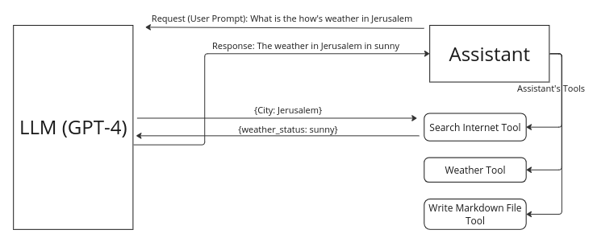

# CMND.ai Extension

## Concepts: 
- **LLM**: A type of AI, like ChatGPT, trained on vast amounts of text data to generate human-like responses based on text inputs.

- **Assistants**: Digital or virtual agents designed to assist users in performing a wide range of tasks via conversational interfaces. These assistants use an LLM as their core intelligence.

- **Tools**: Pre-defined functions or APIs that extend the capabilities of an LLM to perform specific tasks beyond its abilities.
- **RAG**: A technique that enhances Large Language Models by enabling them to access and utilize foundational knowledge.

- **Assistants With Tools**: Digital agents equipped with functionalities that LLMs alone cannot perform, such as accessing real-time data.

- **Assistants With RAG**: Digital agents equipped with the capability to acquire external knowledge and use it to enhance it's capabilites.
  

## Introduction

### Assistants:
computer programs that serve as virtual assistants and communicate with users through text-based interfaces on websites, social media platforms and messaging apps. These chatbots can assist customers, respond to inquiries or start a discussion with them. By equiping the asssitant with tools, the asssitant will be able to perform tasks that the LLM cannot do, and give it's result to the LLM to give you the final answer.

### Tools:
allows you to describe functions to the Assistants API and have it intelligently return the functions that need to be called along with their arguments.



### Create Assistant Exampele
```python
from openai import OpenAI
client = OpenAI()
  
assistant = client.beta.assistants.create(
  name="Math Tutor",
  instructions="You are a personal math tutor. Write and run code to answer math questions.",
  tools=[{"type": "code_interpreter"}],
  model="gpt-4-turbo",
```
In this code, there is tools attribute, where you pass the tools that you have created

### Create Tools Example 

```python
from openai import OpenAI
client = OpenAI()

assistant = client.beta.assistants.create(
  instructions="You are a weather bot. Use the provided functions to answer questions.",
  model="gpt-4-turbo",
  tools=[
    {
      "type": "function",
      "function": {
        "name": "get_current_temperature",
        "description": "Get the current temperature for a specific location",
        "parameters": {
          "type": "object",
          "properties": {
            "location": {
              "type": "string",
              "description": "The city and state, e.g., San Francisco, CA"
            },
            "unit": {
              "type": "string",
              "enum": ["Celsius", "Fahrenheit"],
              "description": "The temperature unit to use. Infer this from the user's location."
            }
          },
          "required": ["location", "unit"]
        }
      }
    }
  }
```

## Getting Started: 
This repository hosts a FastAPI and Flask applications, both designed to execute various server-side tools  and add them to CMND.ai dynamically based on requests. It allows users to query tool information and run specific tools by passing parameters.

1. Clone the repository:
```bash
git clone git@github.com:CyprusCodes/cmnd-extension-sample-python.git
``` 

3. Install the requirements
```bash
pip install requirements.txt
```

5. Navigate to the cloned directory:
```bash
cmnd-extension-sample-python
```

7. Determine whether you are using FastAPI or Flask, and navigate to the chosen directory.

8. Navigate to the tools file

9. Within the tool.py, create your tool definition by first defining data validation schema using Pydentic, then create your tools implementation, and at the end create your tool configuration and metadata

```python
# Define data validation schemas using Pydantic for different functionalities
class WeatherCitySchema(BaseModel):
    city: str = Field(..., title="City", description="City name required"

# Define your tools implementation
async def weather_from_location(city: str):
    api_key = os.getenv('WEATHER_API_KEY')
    if not api_key:
        raise ValueError("API key for weather data is not set in environment variables.")
    url = f"https://api.openweathermap.org/data/2.5/weather?q={city}&appid={api_key}"
    async with httpx.AsyncClient() as client:
        response = await client.get(url)
        return response.json()

# Define your tools configuration and metadata
tool = [
{
        "name": "weather_from_location",
        "description": "Gets the weather details from a given city name",
        "parameters": custom_json_schema(WeatherCitySchema),
        "runCmd": weather_from_location,
        "isDangerous": False,
        "functionType": "backend",
        "isLongRunningTool": False,
        "rerun": True,
        "rerunWithDifferentParameters": True
    }
]
````
7. Run your app (server):
``` bash
python3 main.py
```
8. Any API keys required for your tools should be stored in your .env file.

The rest pertains to endpoints and various functions that support these endpoints. Therefore, you will not need to modify the main.py in any case. Instead, you will only make changes to the tools.py file, where you will initially add your tool's schema definition, implement the tool, and finally configure the tool settings.

## Run Your Server Publicly using ngrok 

1. Create an ngrok account and set up ngrok on your personal computer. [ngrok accounts and setup](https://ngrok.com/docs/getting-started/?os=macos)
2. After setting ngrok on you computer, run the main.py
```python
python3 main.py
```
3. Now your app is runing on localhost, if you want to run it on public URL, so you run the below command in your terminal, but make sure the port of your app specified in your main.py is the same as the port used by ngrok in your command 
```bash
ngrok http 8000 
```
once again the port that you are writing in the above command should be the port that your app runnning on 
